**Python developer** — turning everyday problems into clean, practical tools.

## About

I build focused, no-nonsense Python tools that solve real day-to-day problems:

- **SkipLink** — one-click bypass for ad-driven URL shorteners. Lands you on the
  real link, never renders an ad, and honestly reports the walls it can't climb
  (reCAPTCHA, safelink gates, money pages).
- **Stock Scanner** — Indian stock scanner with ML predictions for your Groww
  watchlist.
- **FileShare** — a web file-sharing experiment.

I develop on Arch Linux (CachyOS), keep things dependency-light, and ship real
products: CLI + GUI, automated CI/CD, and packaged binaries for multiple
platforms.

## Featured projects

<!-- FEATURED:AUTO:START -->

<!-- FEATURED:AUTO:END -->

## GitHub stats

## Contribution snake

<picture>
  <source media="(prefers-color-scheme: dark)" srcset="https://raw.githubusercontent.com/akashmark8-cloud/akashmark8-cloud/output/github-contribution-grid-snake-dark.svg" />
  
</picture>

## Support

Like what I build? Free tools stay free, but your support keeps the coffee
flowing:

---

*Built with Python, a good cup of coffee, and Arch Linux.*

